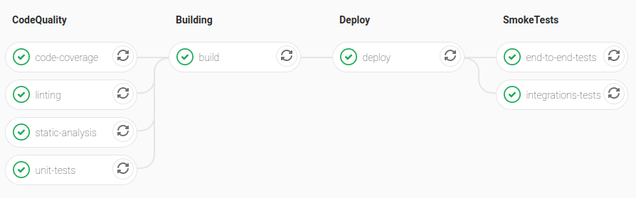
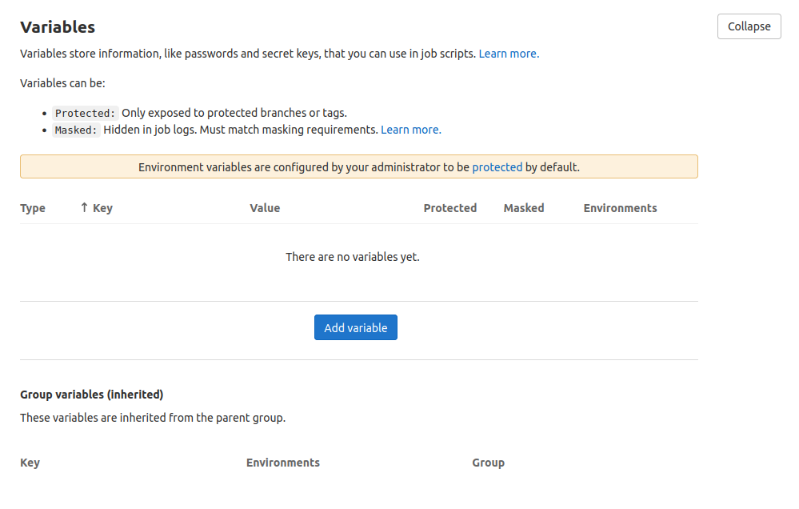
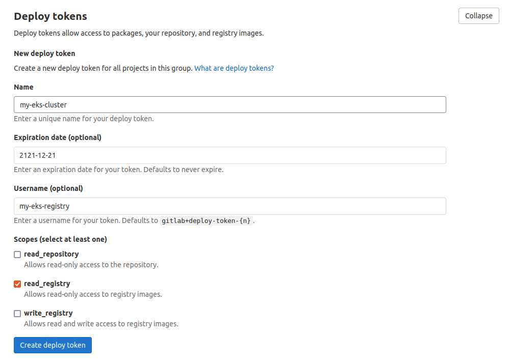
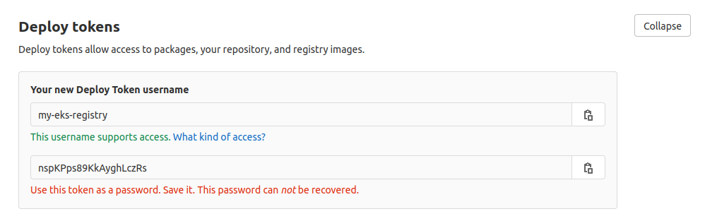

# This is a CI/CD template repository

This repository was built to be a GitLab CI template for different types of applications that would be deployed
in a Kubernetes cluster hosted at AWS EKS, in this document we will discuss overall architecture, code architecture, and
execution of shell scripts.

## Requirements to go through all steps

- [Docker](https://docs.docker.com/install/)
- [AWS CLI](https://docs.aws.amazon.com/cli/latest/userguide/install-cliv2-linux.html)
- [Kubectl](https://kubernetes.io/docs/tasks/tools/install-kubectl/)

## Pipeline architecture

This CI/CD was built to be fully automated, so no human interaction is needed in any step, each step listens to their
events and once the events are triggered they start to execute by themselves. As you can see in the image down below the
pipeline starts by executing a stage with various steps related to CodeQuality, then we have a Building, Deploy,
SmokeTests, and PromoteToProduction stages. In case any step of SmokeTests fails, a rollback is executed, except when
running on development.

PromoteToProduction stage is only triggered when code is pushed into the master/main branch, otherwise this stage won’t
be present in the pipeline. The decision of not rolling back when SmokeTests fail in development was made because
developers may be testing features in that environment and a state of the application needs to keep existing, so they
can come across good solutions to keep a well-architected and well-tested codebase. To know more about environments and
decisions around and CI/CD flows, check this
[blog post]().

<table align="center">
  <tr>
    <td align="center" width="9999">
      
      <i>Pipeline overall architecture</i>
    </td>
  </tr>
</table>

## Code architecture

GitLab CI is based in YAML, but it also has a feature that allows us to run complex shell scripts, by taking advantage
of this feature a more flexible pipeline can be built. Here, YAML is used mainly to define the pipeline jobs and turn
them into modules, so they can exist in different files, that later will compose the pipeline as whole. Also, we have
shell scripts interacting with GitLab runners performing the tasks and interactions needed to create and deploy
artifacts.

Take a look in the code of .gitlab-ci.yml:

```yml
image: <DOCKER_IMAGE>

stages:
  - CodeQuality
  - Building
  - Deploy
  - SmokeTests
  - PromoteToProduction

include:
  - local: .gitlab-ci/jobs/code-quality.yml
  - local: .gitlab-ci/jobs/build.yml
  - local: .gitlab-ci/jobs/deploy.yml
  - local: .gitlab-ci/jobs/end-to-end-tests.yml
  - local: .gitlab-ci/jobs/integrations-tests.yml
  - local: .gitlab-ci/jobs/promote-to-production.yml
```

Now let's check the code of code-coverage.yml job.

```yaml
code-coverage:
  stage: CodeQuality
  script:
    - |
      readonly DESIRED_CODE_COVERAGE=80
      readonly CODE_COVERAGE=$(sh .gitlab-ci/code-coverage.sh | tr -dc '0-9')

      if [[ "${CODE_COVERAGE}" -lt "${DESIRED_CODE_COVERAGE}" ]]; then
        echo "Desired code coverage level is ${DESIRED_CODE_COVERAGE}% found ${CODE_COVERAGE}%"
        exit 1
      fi
```

As mentioned before GitLab has a feature that allows us to run shell scripts, this feature can be used by applying the
special keyword `script:` in the job as shown in the above example.

## Shell script modules


The shell script modules can't be removed or renamed in ways that don't fit in the general architecture of the pipeline,
so be careful in the changes that you may need to do. The modules are predefined scripts in this repository and require
that developers implement them based on the tools and frameworks being used in the project. Down below there is a list
of the current existent modules in this repository.

Existent modules:
 - [code-coverage.sh](./.gitlab-ci/scripts/code-coverage.sh)
 - [end-to-end-tests.sh](./.gitlab-ci/scripts/end-to-end-tests.sh)
 - [integrations-tests.sh](./.gitlab-ci/scripts/integrations-tests.sh)
 - [linting.sh](./.gitlab-ci/scripts/linting)
 - [static-analysis.sh](./.gitlab-ci/scripts/static-analysis.sh)
 - [unit-tests.sh](./.gitlab-ci/scripts/unit-tests.sh)

## Add a pipeline into a project

Be aware that the currently supported languages are `python` and `javascript`. And the supported application types are
**api**, **cronjob**, **frontend** and **lambda**. In case you have a project with an unsupported language, fell free to
change the code of this repository and add support to this unsupported language.

### 1 - Create a pipeline for your project

On your terminal, access your project directory and run:

```shell
git clone git@github.com:jackmiras-scaffolds/gitlab-scaffold.git && ./gitlab-scaffold/install.sh --language=python --type=api
```

### 2 - Configure environment variables

The next step is to access the GitLab page of your project, then goes to **Settings** > **CI / CD** > **Variables**
(Click on the Expand button), then you will see a screen like this:

<table align="center">
  <tr>
    <td align="center" width="9999">
      
      <i>Variables screen</i>
    </td>
  </tr>
</table>

#### Unprotected environment variables:

Down below there is a list of public environment variables used by this CI CD pipeline, it's important to know that the
value from APP_SUBDOMAIN will be concatenated with the name of your environment plus a base URL. In case you are
deploying something into the development environment, the subdomain will be myapi.development.baseurl.com. The only
exception is the production environment, where the environment name has no part into the URL that would be
myapi.baseurl.com.

 - APP_SUBDOMAIN=myapi
 - KUBECONFIG=/builds/<ORGANIZATION_ID>/<REPOSITORY_NAME>/.kube/config
 - DOMAIN_PREFIX=myapi

#### Protected environment variable:

Now define the variables listed down below and make sure that their values can't be seen at GitLab's environment
variable panel.

 - AWS_DEFAULT_REGION
 - AWS_ACCESS_KEY_ID_DEV
 - AWS_SECRET_ACCESS_KEY_DEV
 - AWS_ACCESS_KEY_ID_STAGING
 - AWS_SECRET_ACCESS_KEY_STAGING
 - AWS_ACCESS_KEY_ID_PRODUCTION
 - AWS_SECRET_ACCESS_KEY_PRODUCTION

### 3 - Configure Deploy Tokens

Deploy tokens are needed to allow **GitLab Container Registry** work alongside **AWS EKS**.

It's critical to fill up the `Deploy Tokens` form with the following information, otherwise, you may run into errors:
 - Name: my-eks-cluster
 - Expires at: 2121-12-31
 - Username: my-eks-registry
 - read_repository: unchecked
 - read_registry: checked
 - write_registry: unchecked

To open the form go to **Settings > Repository > Deploy Tokens** (Click on the expand button), then you will see a screen similar to this:

<table align="center">
  <tr>
    <td align="center" width="9999">
      
      <i>Deploy Tokens screen</i>
    </td>
  </tr>
</table>

Once the deployment token is created, make sure to store your `username` and `deploy token` in a safe place because it's
not possible to recover them. Also, make sure that after creating the deployment token, you are seen a screen that is
similar to this:

<table align="center">
  <tr>
    <td align="center" width="9999">
      
      <i>Created deploy token</i>
    </td>
  </tr>
</table>

### 4 - Using a Container Registry with Kubernetes

In this example we are using **GitLab CI Container Registry**, but in case you want to use any other registry, such as **AWS ECR**,
you just need to run the `docker login…` command pointing to the other registry and follow the rest of the other commands.

On your terminal do the login to GitLab CI Container Registry, you can do it by running:

```shell
docker login registry.gitlab.com -u my-eks-registry -p <DEPLOY_TOKEN>
```

The login process creates or updates a config.json file that holds an authorization token, view the config.json file:

```shell
cat ~/.docker/config.json
```

The output should be similar to this:

```json
{
  "auths": {
    "registry.gitlab.com": {
      "auth": "..."
    }
  },
  "HttpHeaders": {
    "User-Agent": "Docker-Client/20.10.8 (linux)"
  }
}
```

A Kubernetes cluster uses the Secret of docker-registry type to authenticate with a container registry to pull a private
image. Now that you have generated your `~/.docker/config.json` with the right credentials to GitLab Container Registry,
you can copy them into the cluster.

Run the following command into the development cluster:
```shell
kubectl create secret generic -n development <YOUR_REPOSITORY_NAME>-registry-secret \
    --from-file=.dockerconfigjson=$HOME/.docker/config.json \
    --type=kubernetes.io/dockerconfigjson
```

Then run the following command into the staging cluster:
```shell
kubectl create secret generic -n staging <YOUR_REPOSITORY_NAME>-registry-secret \
    --from-file=.dockerconfigjson=$HOME/.docker/config.json \
    --type=kubernetes.io/dockerconfigjson
```

And finally, run the following command into the production cluster:
```shell
kubectl create secret generic -n production <YOUR_REPOSITORY_NAME>-registry-secret \
    --from-file=.dockerconfigjson=$HOME/.docker/config.json \
    --type=kubernetes.io/dockerconfigjson
```

### 5 - GitLab CI private runner

In case you prefer not to use a share runner or have the need to run your custom runner of your own, you will have to
specify your private runner in the YAML files under [.gitlab-ci](./.gitlab-ci) directory. You can see more about
specifying private runner in the GitLab CI docs by clicking [here](https://docs.gitlab.com/runner/#tags).
